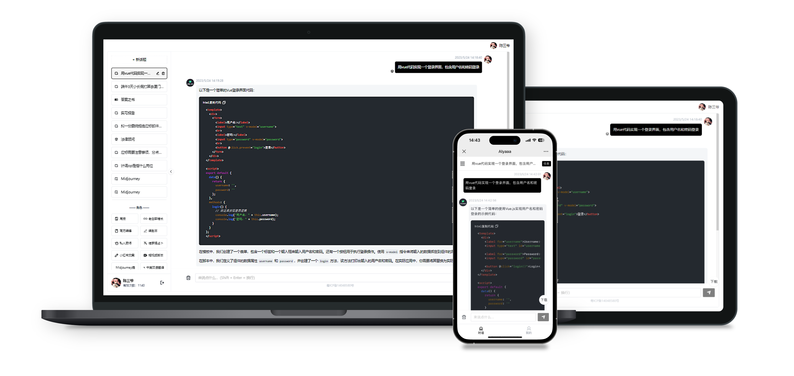

<div  align="center">

  <h1 align="center">GPTLink</h1>

 <p>只需简单几步，即可快速搭建可商用的 ChatGPT 站点。</p>

[体验地址](https://gpt-link.com/?shareOpenId=mjOfmdjyCBEku7fY) / [演示图片](./docs/show/README.md) / [反馈](https://github.com/gptlink/gptlink/issues) / [微信加群](./docs/images/qrcode.png)

[商务合作](./docs/images/qrcode.png) / [打赏开发者](./docs/images/payment.jpeg)



</div>

## 功能概览
- 支持 Docker 部署
- 开箱即用的控制台
- 完美适配移动端
- 自定义付费套餐
- 一键导出对话
- 任务拉新获客

## 开始使用
1. 准备好基础的环境，项目基于 PHP + vue 开发，推荐使用 Docker 进行部署
   - Docker
   - Mysql
   - Redis
2. 准备好一个 apikey（官方注册麻烦，而且动不动就封号，这里使用[GPTLINK](https://gpt-link.com)提供的接口[点此前往注册](https://gpt-link.com)，
注册完成之后进入个人中心申请开发者后可以获取 apikey，过程非常简单，无需审核只需要几分钟即可完成注册。
3. 微信相关资源（[网站应用](https://developers.weixin.qq.com/doc/oplatform/Website_App/WeChat_Login/Wechat_Login.html)，[微信公众号](https://mp.weixin.qq.com/)，[微信支付](https://pay.weixin.qq.com/)），网站应用用于 PC 端扫码登录，公众号用于微信内网页登录，缺省情况将无法在对应渠道使用


## 项目配置
项目提供有限的权限控制功能，项目配置文件位于 `gptserver/.env`，如诺不存在此文件，将`gptserver/.env.exmaple`更名为`.env`作为配置项进行使用， 详细的配置说明 [点此查看](./docs/ENV.md)

## 部署

### 使用Docker部署

#### 方式一：构建镜像后部署
```shell
# 下载代码
git clone git@github.com:gptlink/gptlink.git

# 进去代码库目录
cd gptlink

# 复制env示例文件
cp gptserver/.env.example gptserver/.env

# 修改gptserver/.env文件中的配置信息，参考上文
# vim gptserver/.env

# 构建镜像，构建的过程可能需要几分钟，视网络情况而定
docker build -t gptlink .

# 测试配置项是否正常
docker run -it --rm gptlink /app/gptserver/test.sh

# 运行容器
docker run -d -p 80:80 --name=gptlink gptlink
```

#### 方式二：使用官方 Docker 镜像部署
```
运行项目
docker run -d -p 80:80 \
   --name=gptlink \
   -e DB_HOST="数据库连接地址" \
   -e DB_DATABASE="数据库名称" \
   -e DB_USERNAME="数据库用户名" \
   -e DB_PASSWORD="数据库密码" \
   -e REDIS_HOST="Redis链接地址" \
   -e REDIS_PORT="Redis端口号" \
   overnick/chatgptlink

# 上面为示例代码，环境变量值需要自行修改成你真实的连接地址    
# 如果你需要指定其他环境变量，请自行在上述命令中增加 -e 环境变量=环境变量值 来指定。
```

#### 微信域名校验

用户端: `/app/gptweb`
管理端: `/app/gptweb/admin`
API端：`/app/gptserver`

微信域名校验文件放置`/app/gptweb`目录下即可完成验证

### 云主机部署
目前可提供阿里云/腾讯云机器镜像，扫码加群后发送账号ID可以共享给你。

###  访问
部署完成后访问 `http://域名或IP` 进入对话页面, `/admin`路径访问管理页，管理员账号密码为配置项设置的 `ADMIN_USERNAME` 与 `ADMIN_USERNAME` ，如不传入，默认账号密码为`admin` `admin888`

## 版本计划
- [ ] 兑换码
- [ ] AI生图
- [ ] 分销
- [ ] 对话记录
- [ ] 统计视图

## 参与贡献
贡献之前请先阅读 [贡献指南](./CONTRIBUTING.md)

我们深知这不是一个完美的产品，但是它只是一个开始，欢迎加入我们一起完善

<a href="https://github.com/gptlink/gptlink/graphs/contributors">
  
</a>

## 特别鸣谢
[@overtrue](https://github.com/overtrue) [@Lainy0307](https://github.com/Lainy0307)

## 开源协议

> 反对 996，从我开始。

[Anti 996 License](https://github.com/kattgu7/Anti-996-License/blob/master/LICENSE_CN_EN)
